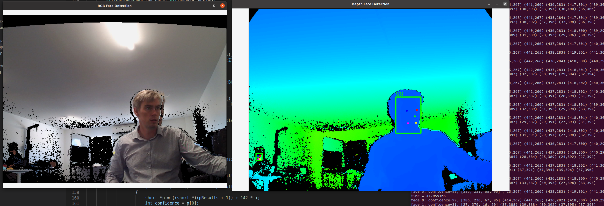

# Chronoptics Kea OpenCV Viewer Example 

[Chronoptics](https://www.chronoptics.com/) designs and develops iToF depth cameras, our latest camera [Kea](https://www.chronoptics.com/cameras) is a highly configurable depth camera, that can also run custom code on camera. This is an example of connecting to the camera and displaying using [libfacedetect](https://github.com/ShiqiYu/libfacedetection) to find faces in the data and display where the face is in depth. 

## Setup instructions

1. Extract the ToF library 
2. Update line the CMakeLists.txt to ToF install location   
3. Install OpenCV and update the CMakeLists.txt
4. Clone and build the libfacedetect library https://github.com/ShiqiYu/libfacedetection , with BUILD_SHAREDLIBS=ON copy the facedetectcnn.h file into the build folder 

To build:

    make build && cd build 
    cmake ../
    make 

This produces kea_opencv_viewer 

    ./kea_opencv_viewer --list 

Will display all the detected cameras 

    ./kea_face_detection --serial 202002a --dmax 15

Is an example to display from camera 202002a. The output is display in 2 separate windows. To close the windows and stop the program hit 'Esc'. 

## Support 
For any issues or support please email me, Refael Whyte, r.whyte@chronoptics.com  

